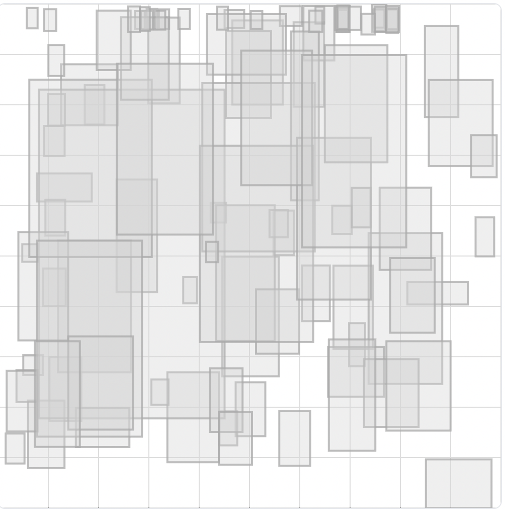
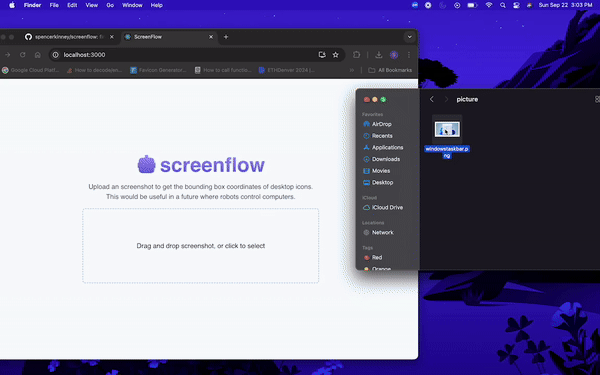

# ScreenFlow

ScreenFlow is a simple React application built with Chakra UI that allows you to upload an image and receive the bounding box coordinates of desktop icons on the computer. The goal of this project is to explore the potential of AI in automating and navigating desktop environments, enabling a robot or AI to visually interact with a computer as humans do.

## Project Overview

This project was a fun exercise in applying computer vision techniques to a unique problem—detecting and localizing desktop icons across different operating systems. The model was trained on a small dataset containing image data from macOS, Windows, and Linux desktops. The goal was to detect and generate bounding box coordinates for three specific desktop icons:
- **Google Chrome**
- **Spotify**
- **Discord**

## Dataset

The dataset used for training consisted of 49 images:
- **27 images** for training
- **7 images** for validation
- **4 images** for testing

Key dataset statistics:
- **Number of Annotations**: 103 annotations across the dataset
- **Average Annotations per Image**: 2.1
- **Median Image Ratio**: 1000x698 (wide)

The dataset was gathered from multiple operating systems, and while it was small, it provided a good starting point for the model. The data includes icons scattered across different parts of the screen, in various sizes, as illustrated by the heatmap below:

Annotations were spread across three classes:
- **Google Chrome**: 39 annotations
- **Discord**: 32 annotations
- **Spotify**: 32 annotations

There is a `icon-detection.v3i.coco.zip` file in the `dataset` folder, containing the training data and corresponding annotations.

## Model Training

The labeling and training of the model were performed using **Roboflow 3.0 Object Detection** as the base model.

## Model Performance

The model was evaluated on the test set, achieving the following benchmarks:

-  **mAP**: 98.9%
-  **Precision**: 93.0%
-  **Recall**: 93.1%

These results demonstrate the model's potential, although it’s important to note that these high results may be influenced by the small size of the test set. Further testing on larger and more diverse datasets would be needed to fully assess the model’s robustness.

## Example Output

### Desktop Screenshot Example

Below is an example screenshot of the model's output, showing the detected bounding boxes around the desktop icons:

While this example demonstrates the model’s ability to detect desktop icons, it is far from perfect. The model will often miss some icons, and it particularly struggles with detecting Discord icons.

### Real-World iPhone Example

In this real-world test, the model was run using an iPhone to capture a live screenshot. Despite being trained only on desktop screenshots, the model performed decently well, as shown in the GIF below:

The model had some trouble with the Discord icon, occasionally confusing it with similar icons, and was also impacted by screen glare. However, the results are promising given the limitations of the training data.

### Web App Example (Windows)

The following GIF was taken from the web app located in the `ui` folder, demonstrating the model detecting icons on a Windows desktop:

## Usage

To use ScreenFlow, simply upload an image of a desktop, and the application will return the bounding box coordinates of the detected desktop icons. This functionality could be a step towards enabling AI or robots to interact with desktop environments visually.

## Future Work

While this project was a successful proof of concept, there is room for improvement:
- **Expand the Dataset**: Collect more images from various desktop environments to improve model robustness.
- **Data Augmentation**: Apply techniques such as rotation, flipping, and scaling to create a more diverse training set.
- **Noise Reduction**: Filter out noisy data to improve model accuracy and reliability.

## Conclusion

ScreenFlow was a fun project that showcases the potential of computer vision in desktop environments. By detecting and localizing desktop icons, this POC lays the groundwork for more advanced applications, such as AI-driven desktop navigation and automation.

## Live Demo

You can try a live demo of the web app [here](https://gentle-sierra-41131-29fa44bce9f8.herokuapp.com/).
